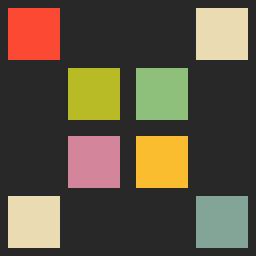

  
  <h3 align="center">Tetrim</h3>
  <h4 align="center">Tetrim is a minimalist clone of the popular game Tetris</h4>

  
    
    

  

  <a href="#instalação">Instalação</a> |
  <a href="#como-usar">Como Usar</a> |
  <a href="#como-contribuir">Como Contribuir</a> |
  <a href="#créditos">Créditos</a>

## About

Tetrim is a minimalist clone of the popular game Tetris, developed by Alexey Pajitnov, Dmitry Pavlovsky and Vadim Gerasimov, and released in June 1984.

The project arose as an opportunity to study the Godot Engine and as the realization of a simple desire I have had for a long time to create a game, even if simple, from beginning to end.

Despite being a simple game, I encountered many challenges during its development, but I was very satisfied with the final result and I hope you have fun too.

## Install 

This game is avaliable to download in Ithio.io project page:

  

## How to play

Like the original game, Tetrim has few commands. I developed the game with the idea of having a simple game that I could play to relax, so please don't expect a competitive game :)

Anyway, let's go to the game controls:

* :arrow_left: and :arrow_right: Arrow: lateral tetramino movement;
* :up_right:: rotation tetramino;
* :arrow_right: drop tetramino;
* :space: pause the game
* :esc: returns to title screen and ends game

## Credits

Art and Programming by me :grin:.

This game wouldn't be as possible as it would be without the amazing resources made available by the talented artists - thank you guys - below:

* [Font Thaleah](https://tinyworlds.itch.io/free-pixel-font-thaleah) created by [Tiny Worlds](https://tinyworlds.itch.io/);
* [Royalty Free Music Pack](https://timbeek.itch.io/royalty-free-music-pack) created by [Tim Beek](https://timbeek.itch.io/);

The color palette used in the game is the [Gruvbox](https://github.com/morhetz/gruvbox) theme palette created by [Pavel Pertsev](https://github.com/morhetz).

Special thanks to the team responsible for [Godot Engine](https://godotengine.org/), for developing a high quality, easy to use and free engine.

This project has mixed licencing. You are free to copy, redistribute and/or modify aspects of this work under the terms of each licence accordingly (unless otherwise specified).

Tetris, developed by Alexey Pajitnov, Dmitry Pavlovsky and Vadim Gerasimov.

Copyright (C) 2021 by Michell Stuttgart

